# 项目结构  
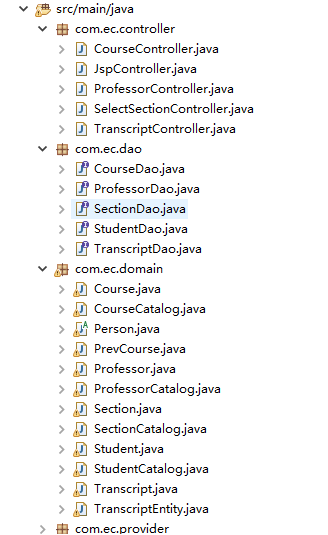  
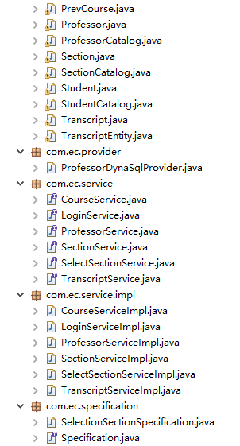  
# 数据库结构  
  
# 领域模型  
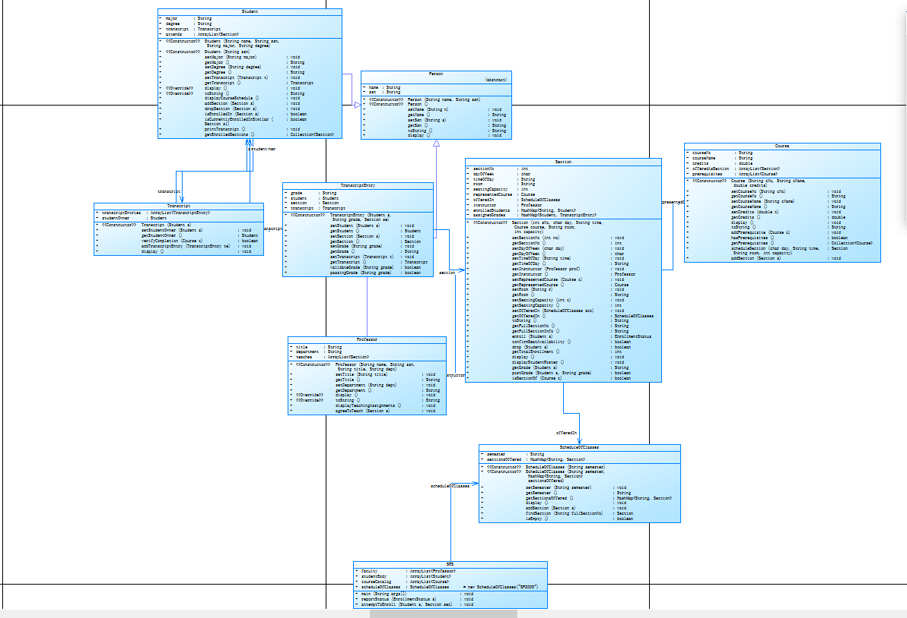  
## 登录  
  
## 进入教师操作界面添加教师  
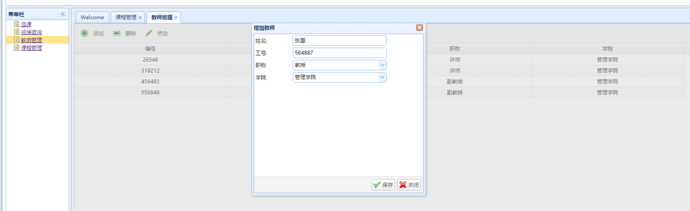  
## 删除教师  
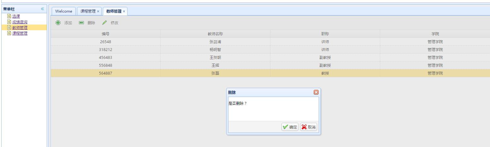  
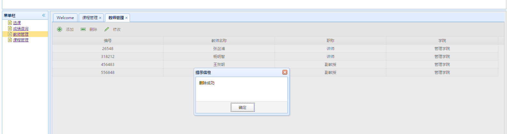  
## 修改教师信息  
  
  
## 进入课程管理  
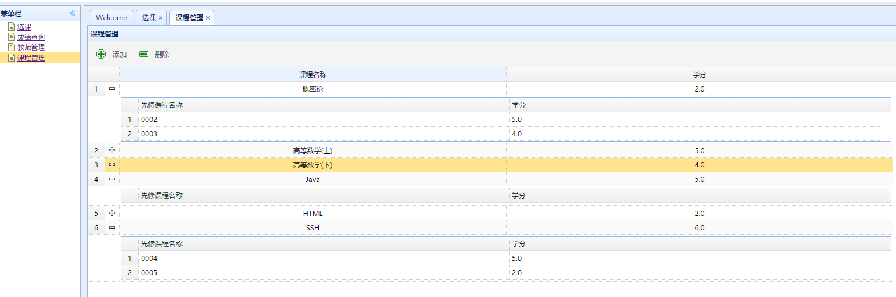  
## 添加课程  
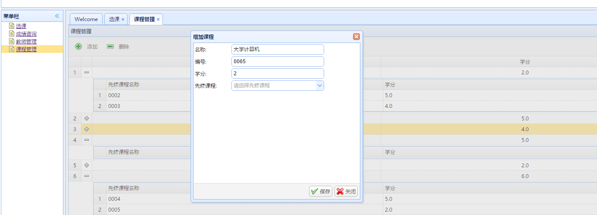  
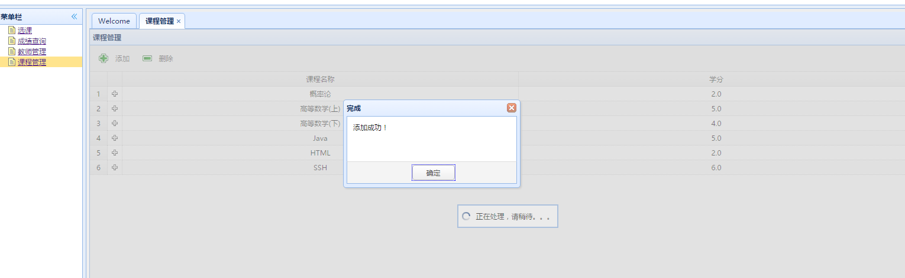  
## 删除课程  
  
  
# 选课  
## 选课前查询可选课程  
  
## 查询已选学生  
  
## 选课确定  
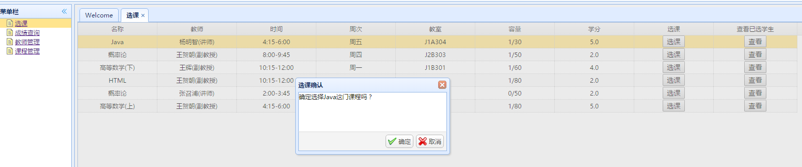	
## 选课条件判断——是否已选过  
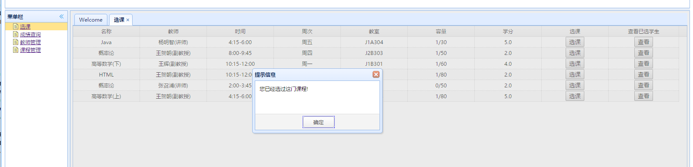  
## 选课条件判断——是否先修课程达标  
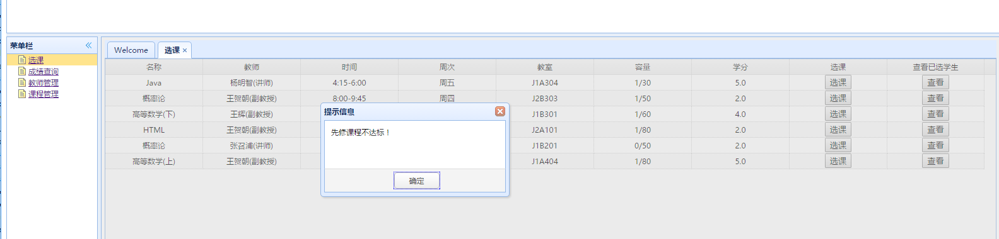  
## 选课条件判断——课程计划是否包含该课程  
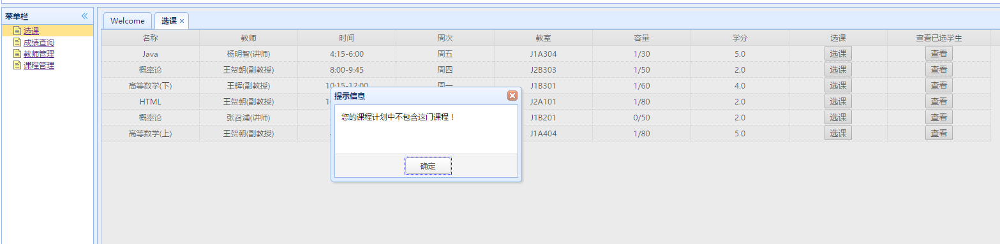  
# 查询成绩  

	

